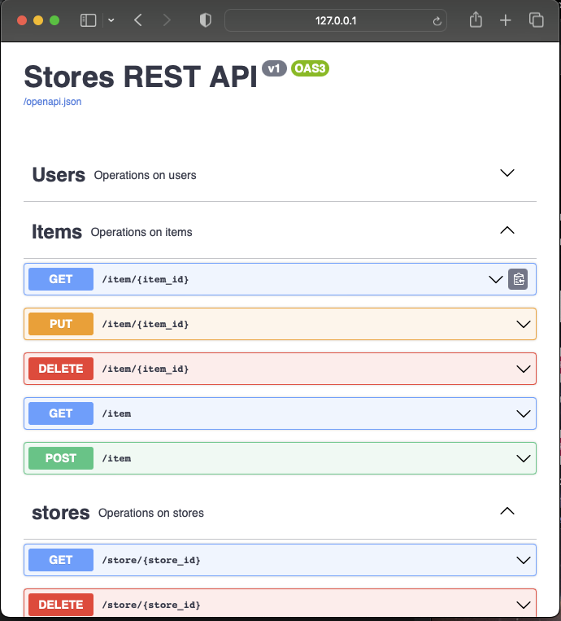

# REST API example project

## Python project with 
- Docker 
- flask-sqlalchemy 
- flask-smorest 
- flask-migrate.

project is set up to log users, store data in a SQLITE database or any other database with URL. 
database has saved versions set up to easily migrate and update.

## swagger ui documentation page
- http://127.0.0.1:5000/swagger-ui

